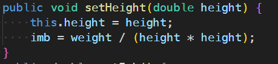
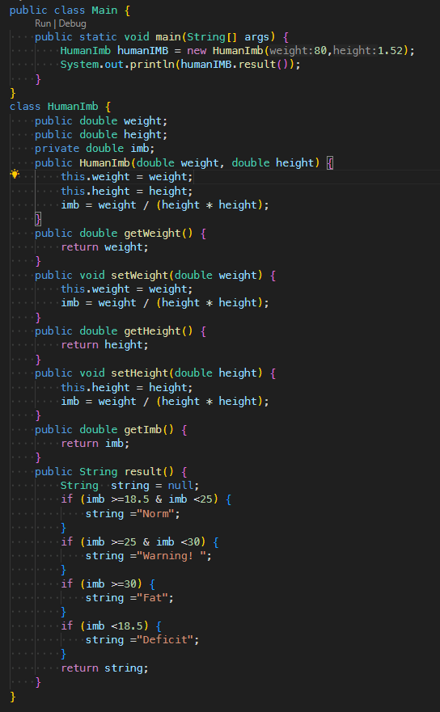
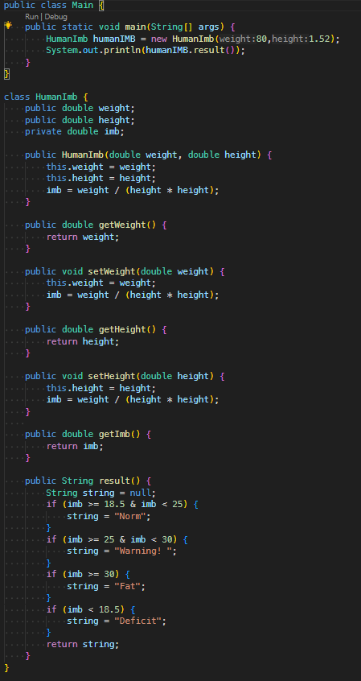

1. Change class name from ```humanIMB``` to ```HumanImb```
2. Refactor fields name from uppercase letters to lowercase words

FROM:


TO: 


3. Remove comments (best comment is the not written on)

4. Change field ```imb``` to non static one
5. Change method ```Result()``` to non static one
6. Change method ```takeImt()``` to non static one
7. Rename method ```Result()``` to ```result()```
8. Rename method ```takeW()``` to ```getWeight()```
9. Rename method ```putW()``` to ```setWeight()```
10. Rename method ```takeH()``` to ```getHeight()```
11. Rename method ```putH()``` to ```setHeight()```
12. Rename method ```takeImt()``` to ```getImb()```
13. Rename constructor parameters
FROM:


TO:


14. Rename parameter in the ```setWeight()``` method

FROM:


TO:


15. Rename parameter in the ```setHeight()``` method

FROM: 


TO:



16. Add blank lines after classes, functions, fields, etc

BEFORE:



AFTER:


15. Fix spaces

BEFORE:


AFTER:



16. Change fields visibility from public to private (because if we change theirs values via fields the imb is not going to be recalculated)

BEFORE:


AFTER:


17. Use logical operators instead of bitwise

BEFORE:


AFTER:


18. Rename ```string``` variable in the ```result()``` method to ```result```

BEFORE:


AFTER:


19. Initialize variable ```result``` with empty string instead of null 

BEFORE:


AFTER:

